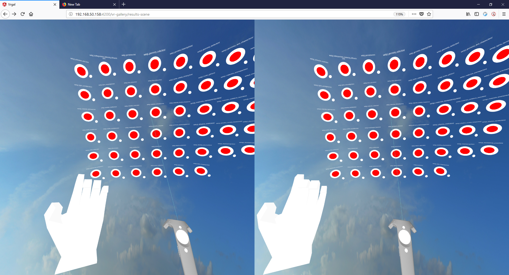
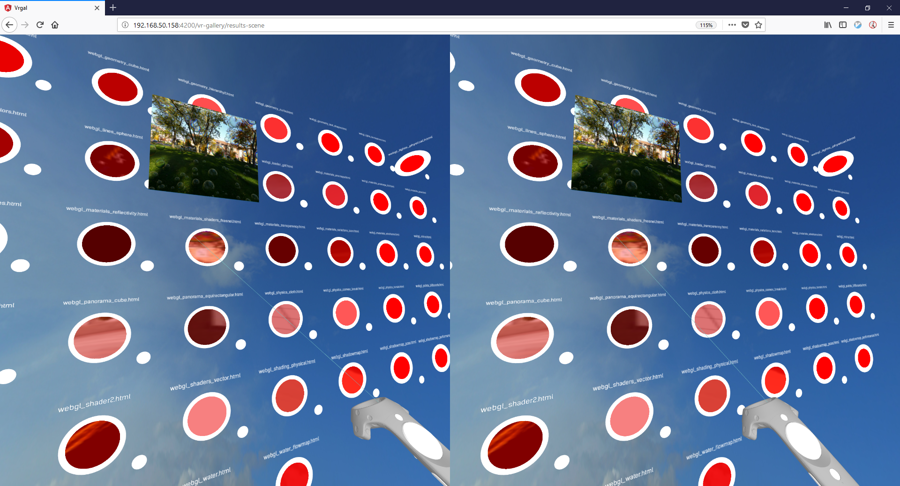
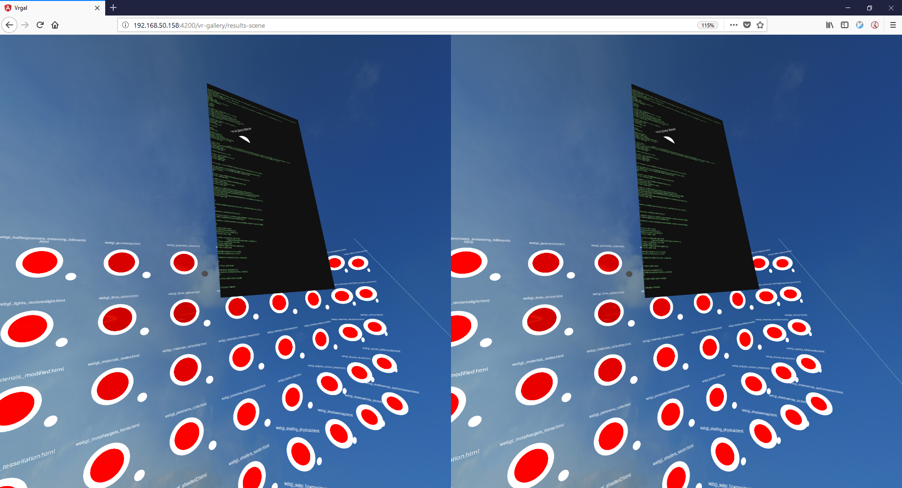
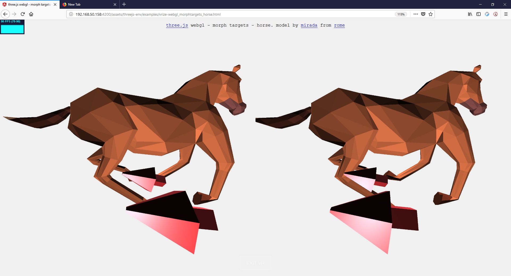

# Vrgal - A gallery of selected three.js examples in VR format.

An [online][aa8b9adb] gallery of three.js examples that have been transformed to enable full VR display and interaction.  This site aspires to eventually become the VR equivalent of the [three.js examples](https://threejs.org/examples/) on-line directory.

Fig. 1: VR Gallery "wall" of links with controllers.  At this outer level, the left hand is used for positioning the camera by "grabbing and pulling" and rotating by "gripping".  The right controller is used for selecting either a preview image, the source code, or activating the link itself via the raycaster.

  [aa8b9adb]: https://infinitewheelie.org/vrgal/main "online gallery"

fig. 2: Popup of preview image upon raycaster hover.

fig. 3: Popup of source code upon raycaster hover on  "View Soure" button.

fig. 4: Lifted three.js example with VR Controllers for moving and rotating the camera.
## Introduction
The three.js graphics library has an extensive library of over 350 sample scripts illustrating the power, expressiveness, and speed of this popular graphics package.      Unfortunately, most of the examples predate the arrival of VR headsets such as the Oculus Rift or the HTC Vive, forcing one to explore them in the rather banal and boring format of a 2-d window, with simple keyboard movement, and  mouse clicks. Certainly this is not the best way to experience these example's true potential.  

Wouldn't it be nicer to experience these examples using full immersive VR?  Imagine seeing a life-size horse galloping in your living room in full VR.

VRGAL, using an [automated parsing algorithm](https://github.com/vt5491/vrgal/tree/master/src/app/vrize) , is able to "lift" or "vr-ize" a large percentage of these "flat" three.js examples to be VR compatible (with the goal of adding many more). Then, using an A-frame based front-end, VRGAL combines these examples into one common interface: a VR "gallery" with which to browse the library.

While this can useful to all interested users, it is hoped this will be especially useful for  game programmers.  To this end, VRGAL allows you to browse the source code for the lifted THREE.js scripts from within the app as well.  

### User Guide
#### Movement
Supports Oculus Rift and HTC Vive controllers.

Move by doing a "full grab" and then pulling:

### Motivation
As an amateur games programmer, one unfortunate fact of life I realized upon writing my first _real_ game was that _good enough_ was, well, not _good enough_.  This is not necessarily true for "standard" apps, where good enough _can_ be _good enough_.  This is because a standard app has some utility even if it's not perfect, esp. if your app is doing something useful that saves people time.  

But games are different.  Games are not a necessity: they are a  luxury.  No one "has to" play your game, they have to _want_ to play it.  And since people only have a limited amount of time to play games, and there's plenty of competition, why should anyone play your amateuristic, half-baked, non-polished game?  In short, the bar for _acceptable_ in games is much higher than for standard web apps.

For a programmer, once you have the game mechanics working, the best way to improve your game (literally and metaphorically) is to improve your game's aesthetics. There are two way you can do this: learning a tool like Blender to improve your scene visuals, and the other is to exploit some of the advanced features in your graphics library, such as lighting and shaders. As a means toward the latter, a good way to do this is to browse and _study_ the three.js examples library.

This was the situation I found myself in upon trying to improve my game's look and feel. Unfortunately, my motivation waned when I realized I could only view three.js examples in a simple flat screen.  This form factor just didn't incentivize me, and perhaps more importantly, gave me no sense of what it would actually look like in VR.

As they say, necessity is the mother of invention. So I investigated how difficult it would be to manually "lift" an example (my first example was [webg_geometry_cube.html](https://github.com/vt5491/vrgal/blob/master/src/assets/threejs-env/examples/vrize-webgl_geometry_cube.html)).  To my surprise, I realized that only a few modifications were actually necessary.  I then further attempted to lift five more before reaching any conclusions about the generality of my method.  Again, to my surprise, I was able to lift them using very much the same modifications as on the first example.  

While this was an interesting result, I sure wasn't about to manually lift all the 300 or so available webgl-enabled examples in the library. Instead, I created a simple [parser](https://github.com/vt5491/vrgal/blob/master/src/app/vrize/services/parser.service.ts) that would automate the process, which would prove to be a valuable effort since in practice I've already had to lift each example several times as I added capabilities to the lift (such as adding controller support).  

Note: the parser succeeds because almost all the three.js examples are written in a very similar format, and almost all use identical naming conventions (for instance the camera is almost always called *camera*, and the scene *scene*).  To parse and lift any arbitrary examples (e.g. ones that are not in the examples library), would be a much more difficult task.

As of this writing, I've managed to lift about fifty examples with a success rate of about 67% (in short, I'm able to lift about 2 out of every 3 examples).

I liken the THREE.js examples library to a warehouse full of fine art paintings, of which there are some potential Picassos and Rembrandts, waiting for someone to come along and frame them (the equivalent of VR-lifting) and then hang them up somewhere.  

That's what VRGAL is all about.

## Code Base Overview
VRGAL is composed of an A-frame front-end client housed in an angular 6 SPA (single-page application), a node-based admin server, a node/express proxy server, and a Rails 5 back-end server responsible for keeping track of example meta-data.

### Related
[vrize service repo](https://github.com/vt5491/vrize-service)
## Release History
2018-07-17: Alpha.
